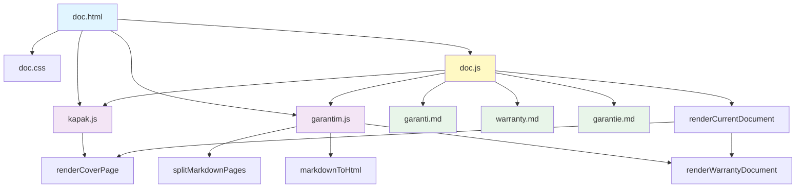

# 📋 WARRANTY DOCUMENT SYSTEM - PROJECT OVERVIEW

> **🎯 Amaç:** Bu dosyayı okuyarak tüm projeyi hatırla. Tüm kodu tekrar okuma.

## 💰 TOKEN EKONOMİSİ

**Bu dosya:** ~4,500-5,000 token (336 satır, 10.83 KB)  
**Tüm proje:** ~10,000-15,000 token (8 dosya, 710+ satır)  
**📉 Tasarruf:** %60-70

### Ne Zaman Bu Dosyayı Oku?
✅ Yeni chat başlatıldığında  
✅ Projeye uzun süre sonra dönüldüğünde  
✅ Hangi dosyayı düzenleyeceğini bilmiyorsan  
✅ Genel mimariyi anlamak istiyorsan  

### Ne Zaman Okuma?
❌ Zaten aktif chat'te çalışıyorsan  
❌ Sadece CSS renk değişikliği gibi basit işler  
❌ Spesifik kod satırını biliyorsan (direkt o dosyayı oku)  

**🎯 Altın Kural:** "Hangi dosyayı okumalıyım?" diye sorma, bu dosyaya bak!

---

## 🏗️ PROJE TANIMI

**Belge Üretim Sistemi** - Endüstriyel parça yıkama makineleri için **Garanti Belgesi** ve **CE Uygunluk Belgesi** üreten web tabanlı uygulama.

### Ana Özellikler:
- ✅ Çok dilli destek (🇹🇷 TR / 🇬🇧 EN / 🇩🇪 DE)
- ✅ 2 belge tipi (Garanti Kartı / CE Belgesi)
- ✅ Dinamik içerik güncelleme (Seri No, Tarih, Model)
- ✅ Kapak sayfası + çoklu sayfa render
- ✅ PDF/Word export özelliği
- ✅ A4 önizleme modu

---

## 📁 DOSYA YAPISI ve GÖREVLER

### **1. doc.html** 
📝 **Ana HTML Yapı**
- Navbar: Login, belge seçimi (Garanti/CE), PDF/Word export, dil seçimi
- Sidebar: 3 input alanı (Seri No, Tarih, Model)
- Preview Area: Belge önizleme bölgesi
- Script yükleme sırası: `kapak.js` → `garantim.js` → `doc.js`

### **2. doc.css**
🎨 **Stil Tanımları**
- Navbar tasarımı (60px yükseklik, dark theme)
- Sidebar form stilleri
- A4 sayfa formatı (210mm × 297mm)
- Cover page özel stilleri (`.cover-page`, `.cover-bg`, `.cover-overlay`)
- Responsive buton stilleri

### **3. doc.js** ⚙️
🧠 **Ana Kontrol Merkezi**
```javascript
// Global Değişkenler:
currentDoc = 'garanti' | 'ce'  // Hangi belge?
currentLang = 'tr' | 'en' | 'de'  // Hangi dil?
garantiMarkdown = ''  // Yüklenen markdown içeriği

// Ana Fonksiyonlar:
initSystem()                      // Sayfa açılışında çalışır
loadGarantiMarkdown()             // Dile göre .md dosyasını fetch eder
renderCurrentDocument()           // Mevcut belgeyi render eder
switchDoc(docType)                // Garanti ↔ CE geçişi
handleLanguageChange()            // Dil değişimi
updatePreview()                   // Input değişiminde güncelleme
exportPDF() / exportWord()        // Export fonksiyonları (henüz implement edilmemiş)
```

**İçerik Veritabanı:**
```javascript
contentDatabase = {
  ce: {
    tr: { title, text, labels },
    en: { title, text, labels },
    de: { title, text, labels }
  }
}
```

### **4. kapak.js** 📄
🖼️ **Kapak Sayfası Motoru**
```javascript
renderCoverPage()  // Kapak HTML'i üretir
```
**Çıktı Yapısı:**
- 3 katmanlı tasarım:
  1. `.cover-bg` → Arka plan fotoğrafı
  2. `.cover-overlay` → Beyaz şeffaf katman
  3. `.cover-content` → Logo + Başlık + Bilgiler
- Dinamik alanlar: Model, Seri No, Tarih
- Şirket bilgisi: CNK ELEKTRONIK MAKINE SANAYI AS

### **5. garantim.js** 📖
🔧 **Markdown İşleme Motoru**
```javascript
splitMarkdownPages(md)   // "---PAGE BREAK---" ile sayfaları ayırır
markdownToHtml(md)       // Markdown → HTML dönüşümü
applyInline(text)        // **bold**, *italic* işler
renderWarrantyDocument(md) // Tam render pipeline
```

**Markdown Sözdizimi Desteği:**
- `#` H1, `##` H2, `###` H3
- `* item` veya `- item` → `<ul><li>`
- `**bold**` → `<strong>`
- `*italic*` → `<em>`
- Boş satır → Paragraf ayırıcı

**Placeholder Değişimi:**
```javascript
{{model}}  → input-model değeri
{{seri}}   → input-seri değeri
{{tarih}}  → input-tarih değeri
```

### **6-8. Markdown İçerik Dosyaları**
📚 **garanti.md** (TR) / **warranty.md** (EN) / **garantie.md** (DE)

**Ortak Yapı:**
```markdown
# Sayfa 1: Garanti Şartları ve Koşulları
- Garanti süresi, kullanım şartları
- Onarım süreçleri
- Değişim/iade hakları
- Garanti istisnaları

---PAGE BREAK---

# Sayfa 2: Garanti Belgesi
- Belge onay bilgileri
- İmalatçı bilgileri (CNK)
- Ürün bilgileri ({{placeholders}})
- Satıcı bilgileri
```

---

## 🔄 VERI AKIŞI

### **1. Sayfa İlk Yüklenme:**
```
doc.html yüklenir
  ↓
kapak.js, garantim.js, doc.js sırayla yüklenir
  ↓
initSystem() çağrılır
  ↓
loadGarantiMarkdown() → garanti.md fetch edilir
  ↓
renderCurrentDocument() çağrılır
  ↓
renderCoverPage() + renderWarrantyDocument() → preview-area'ya inject
```

### **2. Input Değişimi:**
```
Kullanıcı input değiştirir (oninput)
  ↓
updatePreview() çağrılır
  ↓
renderCurrentDocument() yeniden çalışır
  ↓
Preview güncellenir
```

### **3. Dil Değişimi:**
```
Kullanıcı dil seçer (langSelect)
  ↓
handleLanguageChange() çağrılır
  ↓
currentLang güncellenir
  ↓
loadGarantiMarkdown() → yeni dilde .md fetch edilir
  ↓
renderCurrentDocument() → içerik yenilenir
```

### **4. Belge Tipi Değişimi:**
```
Kullanıcı "Garanti Kartı" veya "CE Belgesi" seçer
  ↓
switchDoc('garanti' | 'ce') çağrılır
  ↓
currentDoc güncellenir
  ↓
Buton active class güncellenir
  ↓
renderCurrentDocument() çalışır
  ↓
  ├─ Garanti → Kapak + Markdown sayfaları
  └─ CE → Tek sayfa CE belgesi (contentDatabase'den)
```

---

## 🧩 BAĞIMLILIKLAR



---

## 🎨 STİL YAPISI (doc.css)

### Renk Paleti:
- **Primary Dark:** `#1e293b` (navbar)
- **Secondary Dark:** `#334155` (butonlar)
- **Hover Dark:** `#475569`
- **Active Blue:** `#3b82f6` (seçili tab)
- **Purple:** `#8b5cf6` (login butonu)
- **Red:** `#dc2626` (PDF butonu)
- **Blue:** `#2563eb` (Word butonu)

### Layout:
```css
body: flex column, 100vh, overflow hidden
navbar: 60px height
app-container: flex row
  ├─ sidebar: 300px fixed width, form inputs
  └─ preview-area: flex 1, scroll, A4 pages
```

### A4 Sayfa Formatı:
```css
.a4-page {
  width: 210mm;
  height: 297mm;
  background: white;
  margin: 20px auto;
  padding: 20mm;
  box-shadow: 0 2px 8px rgba(0,0,0,0.1);
}
```

---

## 🚀 KULLANIM SENARYOLARı

### **Senaryo 1: Türkçe Garanti Belgesi Oluşturma**
1. Sayfa açılır (varsayılan: TR, Garanti)
2. Kullanıcı sidebar'dan girer:
   - Seri No: `LYM-2026-001`
   - Tarih: `17.06.2026`
   - Model: `VDL Series S`
3. Preview otomatik güncellenir (oninput)
4. Kapak + 2 sayfa garanti metni görünür
5. "PDF Çıktı" ile export (fonksiyon implement edilecek)

### **Senaryo 2: İngilizce CE Belgesi**
1. Dil seçimi: 🇬🇧 EN
2. Belge tipi: "CE Belgesi"
3. Input değerleri girilir
4. Tek sayfa CE declaration görünür
5. Export yapılır

---

## ⚠️ EKSİK/TODO ÖZELLIKLER

- [ ] `exportPDF()` fonksiyonu implement edilmemiş
- [ ] `exportWord()` fonksiyonu implement edilmemiş
- [ ] `handleLogin()` fonksiyonu tanımlanmamış
- [ ] Logo resmi eklenmemiş (`.cover-logo`)
- [ ] Kapak arka plan fotoğrafı tanımlanmamış (`.cover-bg`)
- [ ] Accessibility (ARIA) etiketleri var ama test edilmemiş

---

## 🔧 TEKNİK DETAYLAR

### JavaScript Özellikleri:
- ES6+ syntax (arrow functions, template literals, async/await)
- Fetch API ile dosya yükleme
- DOM manipulation
- Event handling (onclick, oninput, onchange)

### Performans:
- Markdown dosyaları her dil değişiminde yeniden fetch edilir
- Input her tuşta `updatePreview()` tetikler (debounce yok)
- Tüm sayfa rendering tek seferde yapılır

### Browser Uyumluluğu:
- Modern browser gerektirir (Fetch API, ES6+)
- IE11 desteklenmez

---

## 📞 ŞİRKET BİLGİLERİ

**İmalatçı:**
- Unvan: CNK ELEKTRONİK MAKİNE SANAYİ A.Ş.
- Adres: 1. Organize Sanayi Bölgesi Orhan Işık Bulvarı No:8 SİNCAN - ANKARA
- Telefon: +90 312 267 30 15 (pbx)
- Faks: +90 312 267 30 11

**Ürün:**
- Cinsi: ENDÜSTRİYEL PARÇA YIKAMA MAKİNESİ
- Marka: DOLFIN
- Garanti: 1 YIL / 2500 saat
- Yedek parça garantisi: 10 yıl
- Kullanım ömrü: 10 yıl

---

## 🎯 HIZLI REFERANS - DOSYA OKUMA REHBERİ

### Bir özelliği değiştirmek istiyorsan:

| Değişiklik | Oku |
|-----------|-----|
| Navbar butonu ekle/çıkar | `doc.html` (satır 1-35) |
| Buton rengi değiştir | `doc.css` (satır 40-80) |
| Yeni dil ekle | `doc.js` (contentDatabase + loadGarantiMarkdown) |
| Garanti metni değiştir | `garanti.md` / `warranty.md` / `garantie.md` |
| Kapak tasarımı değiştir | `kapak.js` + `doc.css` (.cover-*) |
| Markdown parsing hatası | `garantim.js` (markdownToHtml) |
| Input alanı ekle | `doc.html` (sidebar) + `doc.js` (placeholder) |
| Sayfa layout değiştir | `doc.css` (.app-container) |
| Export implementasyonu | `doc.js` (exportPDF/exportWord) |

---

## 💡 ÖRNEK KOD OKUMA YOLU

**Problemi anlamak için:**
1. `PROJECT-OVERVIEW.md` (bu dosya) → Genel mimari
2. İlgili bölüm dosyası → Spesifik kod

**Örnek: "Markdown rendering hatası"**
1. Bu dosyayı oku → garantim.js sorumlu
2. garantim.js → `markdownToHtml()` fonksiyonuna bak
3. Sadece o fonksiyonu düzelt

---

## 📊 KOD İSTATİSTİKLERİ

| Dosya | Satır | Görev |
|-------|-------|-------|
| doc.html | ~70 | UI yapısı |
| doc.css | ~200+ | Stiller |
| doc.js | ~120 | Ana logic |
| kapak.js | ~40 | Kapak render |
| garantim.js | ~100 | Markdown engine |
| garanti.md | ~60 | TR içerik |
| warranty.md | ~60 | EN içerik |
| garantie.md | ~60 | DE içerik |

**Toplam:** ~700-800 satır kod

---

## 🔍 HATA AYIKLAMA REHBERİ

### "Sayfa boş görünüyor"
→ Console'u kontrol et  
→ `initSystem()` çalışıyor mu?  
→ `.md` dosyası fetch edildi mi?

### "Placeholder değişmiyor"
→ `updatePreview()` tetikleniyor mu?  
→ Input id'leri doğru mu? (`input-seri`, `input-tarih`, `input-model`)  
→ `garantim.js`'deki regex doğru mu?

### "Dil değişmiyor"
→ `handleLanguageChange()` çalışıyor mu?  
→ Doğru `.md` dosyası var mı? (warranty.md, garantie.md)  
→ `langMap` objesi doğru mu?

### "Markdown yanlış render"
→ `garantim.js` → `markdownToHtml()` kontrol et  
→ `.md` dosyasında sözdizimi hatası var mı?  
→ Sayfa ayracı doğru mu? (`---PAGE BREAK---`)

---

## 🎓 ÖĞRENME NOTU

Bu proje şunları öğretir:
- ✅ Çok dilli web uygulaması mimarisi
- ✅ Markdown parsing ve custom renderer
- ✅ Modüler JavaScript yapısı
- ✅ A4 print-ready sayfa tasarımı
- ✅ Dinamik içerik yönetimi
- ✅ Component-based rendering (kapak, sayfalar)

---

**📅 Son Güncelleme:** 2026-06-22  
**📝 Versiyon:** 1.0  
**👤 Geliştirici:** CNK Elektronik Makine Sanayi A.Ş.

---

> **💾 NOT:** Bu dosyayı her kod değişikliğinde güncelle!
